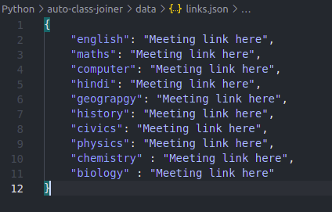
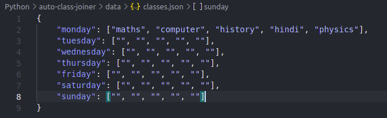

## Auto Class Joiner Python

A code that will help you join your classes automatically, without needing for you being there. 

### How to use the code
1. All the libraries you need are pre-built into python so no need to download anything

2. Clone the repository to a dir and change directory to it `git clone https://github.com/AHiddenDonut/auto-class-joiner`

3. Insert your links into the `data/links.json` file. Ex:

4. Set your time table in the `data/classes.json` file. Ex:

5. Run the `__main__.py` file with `python3 __main__.py` and you're done. Just keep the file running and it will join classes automatically.

### Notes
* Use python 3, instead of python2
* This code is made to join 5 classes, but you can operate it with 4 classes, if you want a modified version instead, DM me at discord on `Donut#4427`
* DM me at `Donut#4427` for help

### License
Copyright (c) 2021 AHiddenDonut